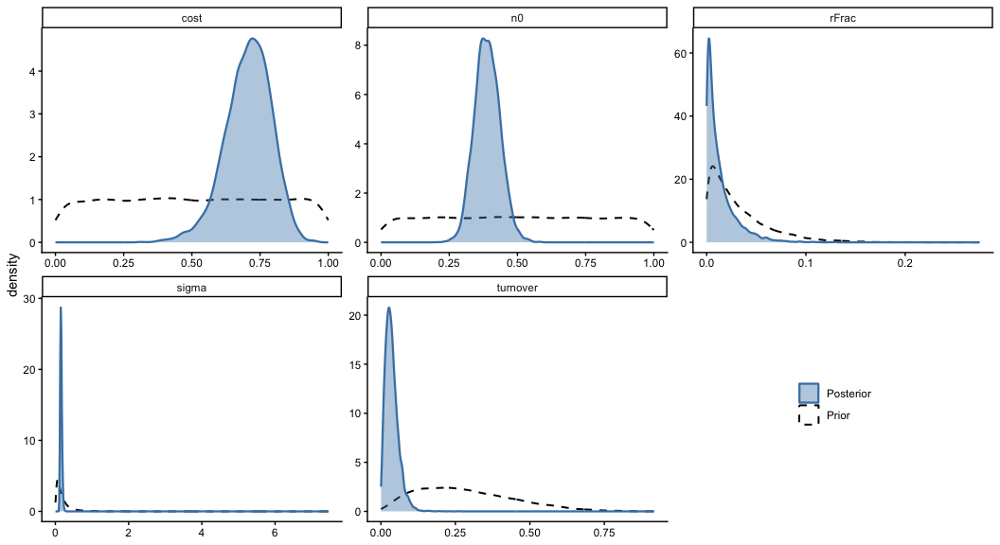
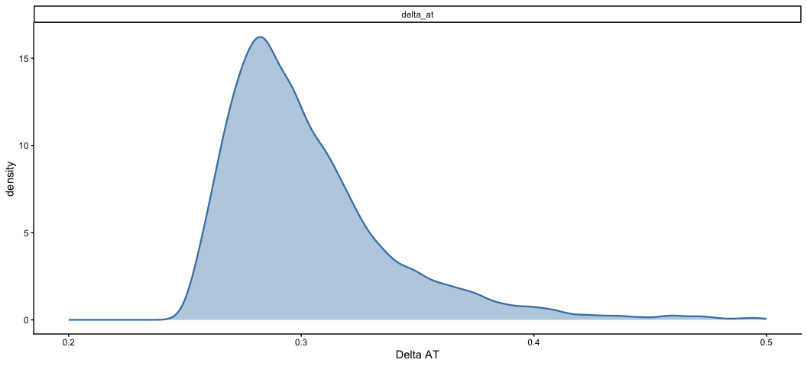
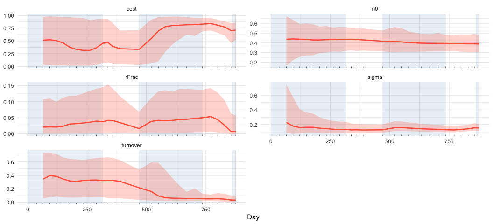
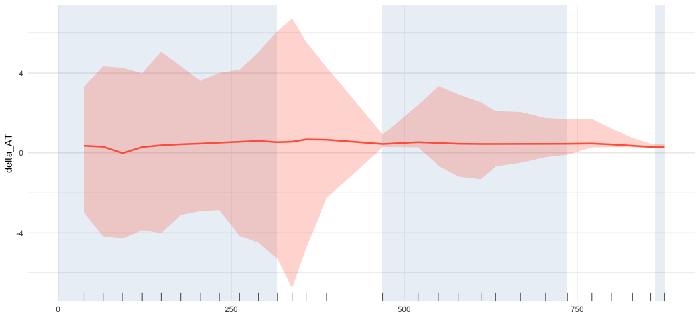
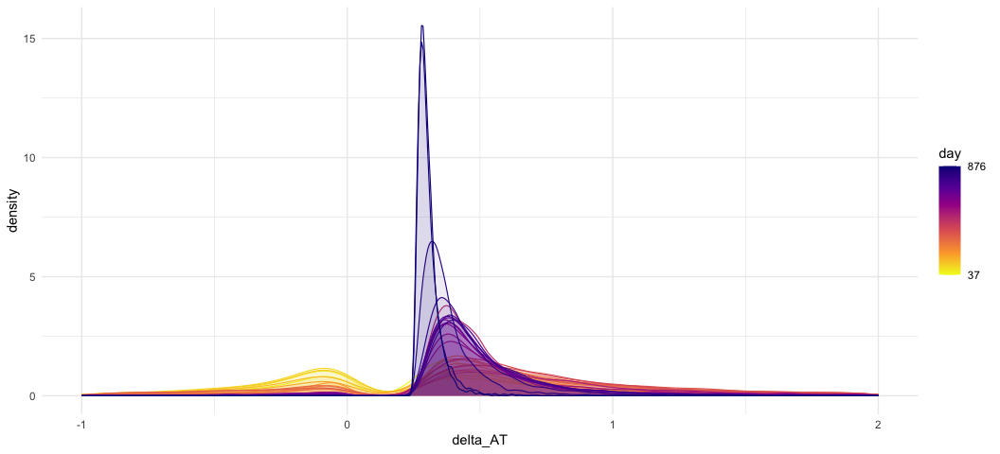
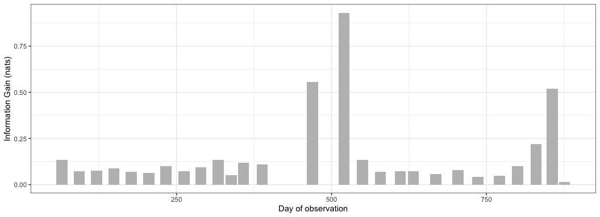
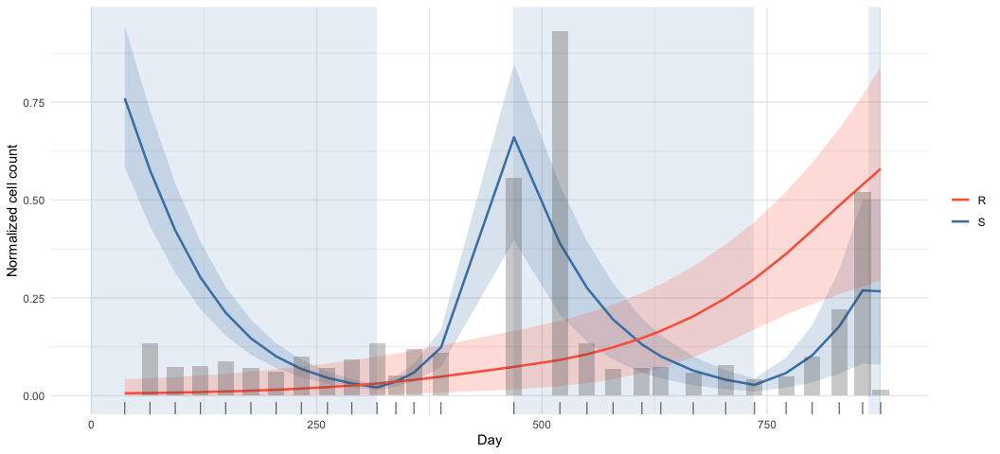

Emil Frej Brunbjerg

-   [What is this document?](#what-is-this-document)
-   [What is Adaptive Therapy?](#what-is-adaptive-therapy)
    -   [Prostate Cancer as a Lotka-Volterra
        Model](#prostate-cancer-as-a-lotka-volterra-model)
    -   [Observations from a Cognitive Science
        Student](#observations-from-a-cognitive-science-student)
-   [Quantifying Uncertainty](#quantifying-uncertainty)
    -   [Patient 12](#patient-12)
    -   [The Mathematical Model](#the-mathematical-model)
    -   [Inferring Parameter Estimates and
        Uncertainties](#inferring-parameter-estimates-and-uncertainties)
    -   [Inferring Cell Counts](#inferring-cell-counts)
-   [Modelling Uncertainty Trough
    Time](#modelling-uncertainty-trough-time)
    -   [KL-Divergence as a Measure of Information
        Gain](#kl-divergence-as-a-measure-of-information-gain)
-   [All in All](#all-in-all)
    -   [Suggested Next Steps](#suggested-next-steps)
-   [Rerunning this Notebook](#rerunning-this-notebook)
-   [References](#references)

# What is this document?

Gallagher et al. (2025) developed two metrics to identify who would
respond best to an experimental type of cancer therapy. These two
metrics determine what cancer patients would benefit more from receiving
*adaptive therapy* rather than standard care. They explicitly state that
they leave the quantification of uncertainty for these metrics for
future work. In this document, **I demonstrate how to quantify the
uncertainty for one of these measures: the *Delta AT Score*.** The Delta
AT Score is the estimated relative benefit in time-to-progression of
choosing adaptive therapy over standard treatment for an individual
patient. Using clinical data of a single patient, I demonstrate how one
could go about estimating the uncertainty of this measure. This document
should therefore be considered a case-study, but it demonstrates the
feasibility of the approach. Applying it to multiple patients and other
similar measures should be straightforward.

Additionally, I investigate how the uncertainty in estimating the Delta
AT Score changes for each observation made for the specific patient. The
trajectory in uncertainty makes me somewhat skeptical that the
uncertainty in Delta AT can reliably be decreased to clinically useful
levels simply by adding more observations. Instead, I think it might be
necessary to adopt ideas from sequential decision-making under
uncertainty such as balancing exploitation and exploration to adequately
deal with the uncertainty in estimates. This could be done by partly
optimizing for observations that reduce uncertainty, such that
observations that provide large reductions in uncertainty are actively
sought.

# What is Adaptive Therapy?

Adaptive therapy attempts to stabilize cancer as a chronic disease
rather than eradicate it. This is done by considering the evolutionary
forces that treatment places on cancer cells (Gatenby et al. 2009). To
my understanding, the idea is that a tumour is typically limited by a
carrying capacity, and its cells therefore compete against each other.
Cells that proliferate faster will tend to crowd out their more slowly
dividing cousins. Assuming that there is some fitness cost to developing
resistance against treatment, treatment-sensitive cells should crowd out
treatment-resistant cells.

It is only when treatment is applied that resistant cells have an
advantage, and if treatment is applied for long enough, the resistant
cells will take over control of the tumor. Adaptive therapy attempts to
strike a balance between killing off sensitive cells to keep the cancer
in check, but not killing so many that the resistant cells will take
over.

It is my understanding that the adaptive therapy research program has
mainly focused on prostate cancer. I have therefore done the same in
this document.

## Prostate Cancer as a Lotka-Volterra Model

Lotka-Volterra models are simple coupled ordinary differential equations
that describe how multiple species grow given the number of individuals
at each time point.

I don’t have a complete overview, but I’ve found that at least two
different Lotka-Volterra models are used throughout adaptive therapy
literature to model treatment trajectories for prostate cancer. There
might be more. But they share the hurdle that they only produce a signal
of the total cell population. In other words, one cannot directly
observe the number of sensitive and resistant cells. Only the biomarker
Prostate Specific Antigen (PSA) is measured, and is thought to be a
signal based on the total number of cancer cells.

## Observations from a Cognitive Science Student

My background is in cognitive science and, beyond likely
misunderstanding crucial aspects of oncology, it has made me note some
parallels between mathematical modelling in adaptive therapy and models
of cognition. Given a forward model, e.g. a Lotka-Volterra model, one
should be able to infer the underlying parameters and states of the
model such as non-directly observable cell counts. I’m mostly familiar
with solving this problem using Bayesian inference. Luckily, a Finnish
master’s thesis (Forslund 2025) showed that this is feasible for at
least one specific formulation of the Lotka-Volterra model for prostate
cancer.

Bayesian inference produces distributions over plausible parameter
values instead of point estimates typical of maximum likelihood
procedures. The Bayesian estimate is instead a distribution the
uncertainty is described by its density at different parameter values.

Assuming that uncertainty in estimates is substantial, planning adaptive
therapy for to me sounds like sequential decision-making under
uncertainty. Explore-exploit dynamics could be crucial, and planning
treatment might benefit from balancing reward maximization and
information gain. In this light, optimal decisions on when to treat
might also depend on the expected information gain from applying
treatment.

# Quantifying Uncertainty

## Patient 12

The following data are PSA readings (biomarker of total cell count)
normalized by the first observation from a prostate cancer patient
undergoing an *intermittent* therapy trial by Bruchovsky et al. (2006).
I’m in doubt whether practitioners would classify this as adaptive
therapy, but it is a data set that is frequently used to model adaptive
therapy. For example Gallagher et al. (2025), who developed the Delta AT
Score that I’m estimating the uncertainty for, use the same data.

## The Mathematical Model

As mentioned above, one way to quantify this uncertainty is to use the
forward Lotka-Volterra model to conduct Bayesian inference to find
distributions over parameters given data. I will do exactly that for
Patient 12. They derive their measures from the following Lotka-Volterra
model (equation 1 in their paper)

$$
\begin{align*}
\frac{dS}{dt} &= r_SS (1 - \frac{S+R}{K})(1-d_DD)-dS \\
\frac{dR}{dt} &= r_RR(1 - \frac{S+R}{K}) - dR\end{align*}
$$

$dS$ is the change in sensitive cells $S$ at time $t$, and $dR$ is the
change in resistant cells $R$. $r_S$ and $r_R$ are proliferation rates
of sensitive and resistant cells. $K$ is the carrying capacity of the
tumour, so the growth of the cells depends on how much of the shared
carrying capacity is taken up. $d_S$ and $d_R$ are the death rates of
sensitive and resistant cells. $d_D$ indicates the extra death rate of
the sensitive cells when the treatment indicator $D$ is on.

Gallagher et al. (2025) then reparameterize the model and fix values of
certain parameters ($K$, $d_D$ and $r_S$) due to some tractability
concerns that I won’t pretend to understand. The takeaway is that the
final model only has the following four free parameters:

-   $cost$*.* The penalty in proliferation rate that resistant cells
    suffer compared to sensitive cells.

-   $turnover$*.* The rate at which both resistant and sensitive cells
    die off.

-   $N_0$. The normalized amount of total cancer cells at $t_0$.

-   $R_0$. The fraction of resistant cells at $t_0$

Given the probabilistic modelling approach, I also have to specify from
what distribution the observations are sampled. For simplicity, I’ve
assumed that normalized Prostate Specific Antigen observations show
Gaussian noise around the normalized total cell count

$$PSA_t \sim N(S_t+R_t, \sigma^2)$$

which leaves us with another free parameter:

-   $\sigma^2$. The amount of noise in the Prostate Specific Antigen
    measurements.

By writing up the reparameterized Lotka-Volterra equation in the
probabilistic programming language *Stan* I can sample parameter values
according to how probable they are given a prior, the data and the
chosen likelihood function. While the fitted model generally follows the
trend in the data points, many observations fall outside the 95%
credible interval. This is a red flag for the adequacy of the
mathematical model and priors, since it is unlikely to produce
observations similar to the actual data. However, it is the same
mathematical model that Gallagher et al. (2025) use.

## Inferring Parameter Estimates and Uncertainties

Fitting the Lotka-Volterra system used by Gallagher et al. (2025) to
patient 12’s normalized Prostate Specific Antigen observations yields a
probability distribution over the parameters of the reparameterized
Lotka-Volterra system. For example, there is substantial uncertainty in
estimating the cost parameter.

<!-- -->

By using the posterior samples, I can propagate the uncertainty in the
parameter estimates through to the Delta AT Score. The Delta AT Score
depends on the Lotka-Volterra parameters (see the original paper for the
mathematical details). Since Stan provides thousands of parameter
samples, I calculate the Delta AT Score for each draw and use the
resulting distribution as my estimate.

<!-- -->

## Inferring Cell Counts

Fitting the model also provides probability distributions over each
unobservable but deterministic quantity. These are quantities that are
downstream of the sampled parameters. For this model, normalized cell
counts $S$ (sensitive) and $R$ (resistant) are unobserved states
determined by the other parameters of the Lotka-Volterra system at each
time point.

This is convenient, because it allows us to infer the cell counts of
sensitive and resistant cells according to how probable they are, given
only the noisy biomarker and the mathematical assumptions. This means
that I get a probability distribution over probable values of sensitive
and resistant cells at each point in time.

In the following plot, I overlay 95% credible intervals of sensitive and
resistant cells at each time point. I’ve also removed observations and
the inferred total count for legibility. My primary observation is that
the uncertainty in cell counts is not constant throughout the
trajectories, but fluctuates quite a bit for the sensitive population
and increases for the resistant population.

# Modelling Uncertainty Trough Time

To model how uncertainty changes over time, I fit the same model up to
each $t$. I then extract posterior estimates for each fit. In other
words, there is a distribution over each parameter for each fit. This
allows us to plot credible intervals for each parameter at each fit and
examine how uncertainty changes with increasing observations.

<!-- -->

While the uncertainties here also depend on the chosen priors, which
likely need reworking from someone who knows oncology, I find it
interesting that only for $\sigma$ and $N_0$ does the uncertainty appear
to decrease in a straightforward “slow but steady decrease”. For *cost*,
*turnover* and *initial resistant fraction*, the uncertainty seems
constant until it radically diminishes. I assume the explanation for
this is that individual observations can all of a sudden rule out a lot
of possible parameter combinations.

The following plot shows the trajectory in uncertainty for the Delta AT
Score.

<!-- -->

Again the uncertainty doesn’t appear to decrease in a straightforward
manner. Rather it is extremely large, spanning from 4x to -4x
improvement until around day 300. This is just a case study, i.e. one
patient and one specific mathematical model, but if it is
representative, this makes me think that in order to get an accurate
picture of the Delta AT Score, I think measurements need to be sampled
carefully, and it might be necessary to proactively perturb the
Lotka-Volterra system to make observations that meaningfully reduce the
uncertainty. This could move treatment planning into the realm of
sequential decision-making under uncertainty, where one would have to
balance immediate reward and gaining information about the system.

## KL-Divergence as a Measure of Information Gain

The above plot shows credible intervals which are easy to interpret:
wider equals more uncertainty. But they hide the true shape of the
distribution.

Crucially, I find that the distribution of the Delta AT Score is
multimodal for patient 12 given the chosen mathematical model.

<!-- -->

I’d therefore argue that a more principled measure of information gain
in the Delta AT Score is the KL divergence between posterior densities
at consecutive observations rather than the width of a credible
interval. The following plot shows exactly that.
<!-- -->

From this it is also clear that information gain in the Delta AT Score
does not follow a straightforward pattern where more observations
generally lead to more information. Instead, some observations radically
change the posterior density for the Delta AT Score. The uneven spacing
of observations does complicate hypothesizing about what might be
driving information gain. My take is that the model can’t decipher
enough about cost nor the initial resistant population until resistant
cells make up a substantial part of the PSA signal.

<!-- -->

Assuming that this case study in patient 12 is representative, I think
targeting information gain could be important in planning treatments
given the circumstances: a relatively complicated mathematical model,
only one presumably noisy output (PSA), and few observations. However,
our ability to perturb the system by applying treatment might allow us
to gain an accurate picture of the system. I suspect two things are
going on when information gain peaks at the beginning of the second
treatment block: i) the model is only able to differentiate how much of
the signal comes from resistant cells when treatment is being applied,
since they react differently to treatment than sensitive cells; ii) the
resistant cells have been freed from the competitive pressure of the
sensitive cells during the second treatment block, their numbers
therefore grow, and the model substantially updates the *cost*
parameter. This update then cascades through to large information gain
about the Delta AT Score.

# All in All

Adaptive therapy is a cancer therapy that attempts to manipulate
evolutionary dynamics to stabilize rather than eradicate cancers.
Gallagher et al. (2025) propose a metric to determine the potential
benefit of adaptive therapy over standard care for prostate cancer
patients. They explicitly state that they leave the quantification of
uncertainty in these measures for future work. In this notebook, I have
used Bayesian inference to quantify the uncertainty in one of those
metrics: the Delta AT Score. I have further conducted a case study
tracing the *trajectory of uncertainty* for each added observation for a
single prostate cancer patient. I argue that uncertainty in this measure
does not decrease straightforwardly with each additional observation.
Instead, it may be necessary to proactively search out observations that
reduce the uncertainty, and lessons from sequential decision-making
under uncertainty may apply.

## Suggested Next Steps

I would suggest that someone decides on a provisional candidate
mathematical model of prostate cancer dynamics. Then one could simulate
noisy emissions from this system. For this to be possible, one would
have to map cell counts to Prostate Specific Antigen measurements. I
assume there is substantial noise in this mapping, but again I’m
definitely not an expert on this. My first instinct would be to do
Bayesian model comparison across different likelihoods on the Bruchovsky
data. One could then place rewards on extending time-to-progression and
on making observations that lead to better information about the system.
KL divergence strikes me as an obvious starting choice for measuring
information gain. Optimal strategies under this scenario would likely
require flexible observation scheduling, so that measurements are made
when high information gain is predicted.

For another project, I formulated the treatment problem as a discrete
state-space and compared two canonical Partially Observable Markov
Decision Process solvers on their ability to extend time to progression.
I would be interested in reformulating this as a continuous state-space
problem if anyone cares to fund and collaborate. I don’t know if the
problem is tractable for a continuous state-space, but Saporta et al.
(2024) appear to have found solutions to a somewhat similar problem.

# Rerunning this Notebook

Given the hardware used, you might have to change the number of cores
used for running stan. See the fitting script. Fitting the entire
procedure took a while (approx. an hour) on a M1 MacBook Air for
reference. You will need to have the following in place:

-   Functioning version of R and relevant packages installed
-   Stan properly setup
-   The [patient
    data](https://www.nicholasbruchovsky.com/clinicalResearch.html).

# References

Bruchovsky, Nicholas, Laurence Klotz, Juanita Crook, Shawn Malone,
Charles Ludgate, W. James Morris, Martin E. Gleave, and S. Larry
Goldenberg. 2006. “Final results of the Canadian prospective phase II
trial of intermittent androgen suppression for men in biochemical
recurrence after radiotherapy for locally advanced prostate cancer:
clinical parameters.” *Cancer* 107 (2): 389–95.
<https://doi.org/10.1002/cncr.21989>.

Forslund, John. 2025. “Bayesian Inference of Biomarker Dynamics in
Prostate Cancer Patients.”

Gallagher, Kit, Maximilian A R Strobl, Philip K Maini, and Alexander R A
Anderson. 2025. “Predicting Treatment Outcomes from Adaptive Therapy A
New Mathematical Biomarker.”

Gatenby, Robert A., Ariosto S. Silva, Robert J. Gillies, and B. Roy
Frieden. 2009. “Adaptive Therapy.” *Cancer Research* 69 (11): 4894–4903.
<https://doi.org/10.1158/0008-5472.CAN-08-3658>.

Saporta, Benoîte de, Aymar Thierry d’Argenlieu, Régis Sabbadin, and
Alice Cleynen. 2024. “A Monte-Carlo Planning Strategy for Medical
Follow-up Optimization: Illustration on Multiple Myeloma Data.” *PLOS
ONE* 19 (12): e0315661. <https://doi.org/10.1371/journal.pone.0315661>.

